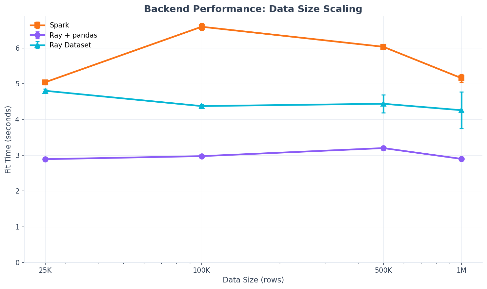
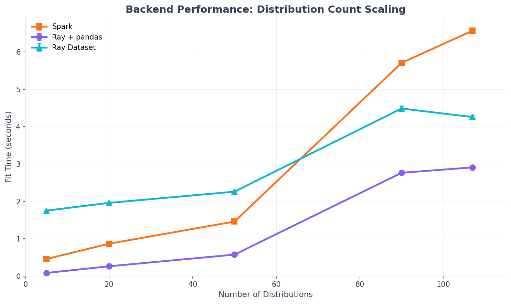

Backend Guide
=============

spark-bestfit uses a pluggable backend architecture that enables distribution fitting
on different compute platforms. Choose the backend that matches your data location
and infrastructure.

.. note::
   **Why "spark-bestfit" with multiple backends?** The library was originally built
   for Apache Spark, hence the name. v2.0 added pluggable backends while keeping the
   name for backward compatibility—existing code using ``DistributionFitter(spark)``
   works unchanged. All backends use identical scipy fitting algorithms.

Choosing a Backend
------------------

.. list-table::
   :header-rows: 1
   :widths: 15 25 30 30

   * - Backend
     - Best For
     - Data Input
     - Install
   * - **SparkBackend**
     - Production clusters, large datasets
     - Spark DataFrame
     - PySpark required (BYO or ``[spark]``)
   * - **RayBackend**
     - Ray clusters, ML pipelines
     - pandas DataFrame, Ray Dataset
     - ``pip install spark-bestfit[ray]``
   * - **LocalBackend**
     - Testing, development, small data
     - pandas DataFrame
     - Included

Decision Matrix
~~~~~~~~~~~~~~~

.. list-table::
   :header-rows: 1
   :widths: 30 35 35

   * - Scenario
     - Recommended Backend
     - Why
   * - Data in Spark DataFrames
     - SparkBackend
     - No data movement needed
   * - Data in pandas (< 10M rows)
     - RayBackend or LocalBackend
     - Lower overhead than Spark
   * - Data in Ray Datasets
     - RayBackend
     - Native distributed processing
   * - Unit tests
     - LocalBackend
     - No cluster dependencies
   * - 100M+ rows
     - SparkBackend
     - Mature distributed histograms
   * - ML pipeline (Ray Tune/Train)
     - RayBackend
     - Same ecosystem

SparkBackend
------------

The default backend for production workloads with Spark clusters.

**Installation:** Included by default.

**Usage:**

.. code-block:: python

   from pyspark.sql import SparkSession
   from spark_bestfit import DistributionFitter, SparkBackend

   spark = SparkSession.builder.getOrCreate()

   # Implicit (backward compatible)
   fitter = DistributionFitter(spark)

   # Explicit
   backend = SparkBackend(spark)
   fitter = DistributionFitter(backend=backend)

   # Fit from Spark DataFrame
   results = fitter.fit(df, column="value")

**Configuration:**

.. code-block:: python

   from pyspark.sql import SparkSession

   spark = (
       SparkSession.builder
       .appName("DistributionFitting")
       # Enable Arrow for efficient serialization
       .config("spark.sql.execution.arrow.pyspark.enabled", "true")
       # Enable Adaptive Query Execution
       .config("spark.sql.adaptive.enabled", "true")
       .getOrCreate()
   )

**When to use:**

- Data already in Spark DataFrames
- Existing Spark infrastructure (YARN, Kubernetes, Databricks)
- Very large datasets (100M+ rows)
- Need distributed histogram computation

RayBackend
----------

Alternative backend for Ray clusters and ML pipelines.

**Installation:**

.. code-block:: bash

   pip install spark-bestfit[ray]

**Usage with pandas:**

.. code-block:: python

   from spark_bestfit import DistributionFitter, RayBackend
   import pandas as pd
   import numpy as np

   # Auto-initializes Ray if not running
   backend = RayBackend()
   fitter = DistributionFitter(backend=backend)

   # Fit from pandas DataFrame
   df = pd.DataFrame({"value": np.random.normal(50, 10, 10000)})
   results = fitter.fit(df, column="value")

**Usage with Ray Datasets:**

.. code-block:: python

   import ray

   # Create Ray Dataset
   ds = ray.data.from_pandas(df)

   # Distributed histogram computation
   results = fitter.fit(ds, column="value")

When using Ray Datasets:

- Histograms computed via distributed ``map_batches()``
- No raw data collected to driver
- Automatic partitioning and parallelism

**Cluster Connection:**

.. code-block:: python

   # Auto-detect existing cluster
   backend = RayBackend(address="auto")

   # Connect to specific cluster
   backend = RayBackend(address="ray://cluster-head:10001")

   # Limit local resources
   backend = RayBackend(num_cpus=8)

**When to use:**

- ML pipelines (Ray Tune, Ray Train, Ray Serve)
- Data in pandas or Ray Datasets
- Kubernetes with Ray clusters
- When Spark is unavailable

LocalBackend
------------

Lightweight backend for testing and development. No cluster dependencies.

**Installation:** Included by default.

**Usage:**

.. code-block:: python

   from spark_bestfit import DistributionFitter, LocalBackend
   import pandas as pd

   backend = LocalBackend(max_workers=4)
   fitter = DistributionFitter(backend=backend)

   df = pd.DataFrame({"value": [1.0, 2.0, 3.0, 4.0, 5.0]})
   results = fitter.fit(df, column="value")

**When to use:**

- Unit tests (no Spark/Ray required)
- Development and prototyping
- Small datasets (< 100K rows)
- CI/CD pipelines

**Example test fixture:**

.. code-block:: python

   import pytest
   from spark_bestfit import DistributionFitter, LocalBackend

   @pytest.fixture
   def fitter():
       return DistributionFitter(backend=LocalBackend())

   def test_fit_normal(fitter):
       df = pd.DataFrame({"x": np.random.normal(0, 1, 1000)})
       results = fitter.fit(df, column="x")
       assert results.best(n=1)[0].distribution == "norm"

Performance Comparison
----------------------

Benchmarks on local development machine (Apple M-series, 10 cores):

**Data Size Scaling (90 distributions)**

.. list-table::
   :header-rows: 1
   :widths: 20 20 20 20 20

   * - Data Size
     - Spark
     - Ray + pandas
     - Ray Dataset
     - Fastest
   * - 25K
     - 4.8s
     - 2.8s
     - 4.8s
     - **Ray+pandas**
   * - 100K
     - 6.6s
     - 2.9s
     - 4.2s
     - **Ray+pandas**
   * - 1M
     - 5.0s
     - 2.7s
     - 4.5s
     - **Ray+pandas**

**Distribution Count Scaling (10K rows)**

.. list-table::
   :header-rows: 1
   :widths: 25 20 20 20

   * - Distributions
     - Spark
     - Ray + pandas
     - Ray Dataset
   * - 5
     - 0.46s
     - 0.09s
     - 1.79s
   * - 50
     - 1.46s
     - 0.60s
     - 2.34s
   * - 90
     - 5.71s
     - 2.80s
     - 4.53s

**Key Observations:**

1. **Startup overhead**: Spark has higher JVM startup cost; Ray+pandas is fastest for small workloads
2. **Scaling**: All backends show similar O(D) scaling with distribution count
3. **Local mode**: These benchmarks are local mode; cluster overhead is amortized on real clusters
4. **Fit quality**: All backends use identical scipy fitting - results are identical

Common Patterns
---------------

**Backend-agnostic code:**

.. code-block:: python

   from spark_bestfit import DistributionFitter

   def fit_distribution(backend, data, column):
       """Works with any backend."""
       fitter = DistributionFitter(backend=backend)
       return fitter.fit(data, column=column)

   # Use with Spark
   results = fit_distribution(SparkBackend(spark), spark_df, "value")

   # Use with Ray
   results = fit_distribution(RayBackend(), pandas_df, "value")

   # Use in tests
   results = fit_distribution(LocalBackend(), test_df, "value")

**Progress tracking (all backends):**

.. code-block:: python

   from spark_bestfit.progress import console_progress

   results = fitter.fit(
       df,
       column="value",
       progress_callback=console_progress()
   )

API Reference
-------------

.. autoclass:: spark_bestfit.backends.spark.SparkBackend
   :members:
   :undoc-members:

.. autoclass:: spark_bestfit.backends.ray.RayBackend
   :members:
   :undoc-members:

.. autoclass:: spark_bestfit.backends.local.LocalBackend
   :members:
   :undoc-members:
