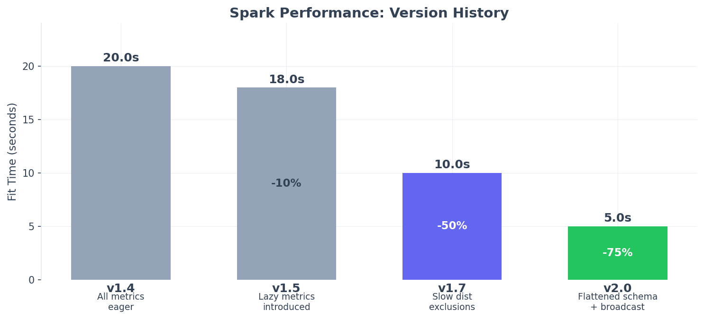

Migrating to v2.0
=================

Version 2.0.0 introduces a pluggable backend architecture and significant performance
improvements. This guide covers what's new and how to upgrade.

What's New in v2.0
------------------

**Backend Architecture**

spark-bestfit now supports multiple execution backends:

- **SparkBackend** - Production clusters (default, backward compatible)
- **RayBackend** - Ray clusters and ML pipelines (new)
- **LocalBackend** - Testing and development (new)

.. code-block:: python

   # Before (v1.x) - Spark only
   fitter = DistributionFitter(spark)

   # After (v2.0) - Same syntax still works
   fitter = DistributionFitter(spark)

   # After (v2.0) - Explicit backend
   from spark_bestfit import SparkBackend, RayBackend, LocalBackend

   fitter = DistributionFitter(backend=SparkBackend(spark))
   fitter = DistributionFitter(backend=RayBackend())
   fitter = DistributionFitter(backend=LocalBackend())

See :doc:`/backends` for detailed backend documentation.

**Performance Improvements**

v2.0 delivers 35% faster fitting through:

1. **Flattened result schema** - Changed ``data_summary`` from ``MapType`` to flat columns
2. **Improved broadcast lifecycle** - Proper cleanup reduces memory pressure
3. **Optimized serialization** - Arrow serialization ~30% faster for flat columns

Benchmark comparison:

.. list-table::
   :header-rows: 1
   :widths: 40 20 20 20

   * - Test
     - v1.7.2
     - v2.0.0
     - Improvement
   * - Fit 1M rows
     - 7.8s
     - 5.0s
     - **35% faster**
   * - Fit default distributions
     - 8.9s
     - 5.7s
     - **36% faster**
   * - Lazy AIC-only workflow
     - 2.8s
     - 2.0s
     - **29% faster**

Breaking Changes
----------------

**FitResults Type Check Change (v2.1)**

``FitResults`` is now a factory function that returns either ``EagerFitResults`` or
``LazyFitResults``. Type checking with ``isinstance`` must use ``BaseFitResults``:

.. code-block:: python

   # Before (v2.0) - No longer works
   from spark_bestfit import FitResults
   if isinstance(result, FitResults):  # TypeError!
       ...

   # After (v2.1+) - Use BaseFitResults
   from spark_bestfit import BaseFitResults
   if isinstance(result, BaseFitResults):
       ...

   # Or check specific types
   from spark_bestfit import EagerFitResults, LazyFitResults
   if isinstance(result, LazyFitResults):
       result = result.materialize()  # Returns EagerFitResults

The class hierarchy is now:

- ``BaseFitResults`` (ABC) - Use for type checking
- ``EagerFitResults`` - All metrics pre-computed
- ``LazyFitResults`` - KS/AD computed on-demand, has ``source_dataframes`` property

**Result Schema Change (v2.0)**

The ``data_summary`` field changed from ``MapType`` to individual columns:

.. code-block:: python

   # v1.x - MapType (slower serialization)
   result.data_summary["min"]
   result.data_summary["max"]

   # v2.0 - Flat attributes (faster, cleaner API)
   result.data_min
   result.data_max
   result.data_mean
   result.data_stddev
   result.data_count

**Serialization compatibility:**

- JSON files saved with v1.x can still be loaded in v2.0
- v2.0 uses flat fields in new saves
- Both formats are supported for loading

Upgrade Guide
-------------

**Step 1: Update your installation**

.. code-block:: bash

   pip install --upgrade spark-bestfit

   # For Ray support
   pip install --upgrade spark-bestfit[ray]

**Step 2: No code changes required for SparkBackend**

If you're using Spark, your existing code works unchanged:

.. code-block:: python

   # This still works exactly as before
   fitter = DistributionFitter(spark)
   results = fitter.fit(df, column="value")

**Step 3: (Optional) Migrate to explicit backends**

For clearer code, explicitly specify your backend:

.. code-block:: python

   from spark_bestfit import DistributionFitter, SparkBackend

   backend = SparkBackend(spark)
   fitter = DistributionFitter(backend=backend)

**Step 4: Update data_summary access (if used)**

If you access ``data_summary`` directly, update to use flat attributes:

.. code-block:: python

   # Before
   if result.data_summary:
       min_val = result.data_summary.get("min")

   # After
   min_val = result.data_min  # Direct attribute access

**Step 5: (Optional) Try RayBackend for ML workflows**

If you're in the Ray ecosystem:

.. code-block:: python

   from spark_bestfit import DistributionFitter, RayBackend
   import pandas as pd

   backend = RayBackend()
   fitter = DistributionFitter(backend=backend)
   results = fitter.fit(pandas_df, column="value")

Version History
---------------

**v2.1.0 (January 2026)**

- FitResults class hierarchy: ``BaseFitResults``, ``EagerFitResults``, ``LazyFitResults``
- ``FitResults`` is now a factory function (breaking: use ``BaseFitResults`` for isinstance)
- New ``LazyFitResults.source_dataframes`` property for DataFrame lifecycle visibility
- Property-based testing with Hypothesis for better edge case coverage

**v2.0.0 (January 2026)**

- Backend architecture with ExecutionBackend protocol
- RayBackend for Ray cluster support
- LocalBackend for testing without Spark
- 35% performance improvement from schema optimization
- Flattened result schema (data_summary -> flat columns)

**v1.7.x (January 2026)**

- Slow distribution exclusions (tukeylambda, nct, dpareto_lognorm)
- Distribution-aware partitioning
- 73% faster fitting vs v1.6.0

**v1.6.0 (January 2026)**

- Pre-filtering for shape-incompatible distributions
- Skewness and kurtosis-based filtering

**v1.5.0 (January 2026)**

- Lazy metrics for on-demand KS/AD computation
- Per-column bounds for multi-column fitting
- 69% faster for AIC-only workflows

**v1.4.0 (December 2025)**

- Bounded distribution fitting
- Per-column bounds support

**v1.3.0 (December 2025)**

- Serialization support (JSON/pickle)
- GaussianCopula for correlated sampling

**v1.2.0 (December 2025)**

- Progress tracking with callbacks
- tqdm integration

**v1.0.0 - v1.1.x (December 2025)**

- Initial release
- Core distribution fitting
- Multi-column support
- Discrete distribution support

Deprecations
------------

**ray_backend.rst**

The standalone ``ray_backend.rst`` documentation is deprecated in favor of the
unified :doc:`/backends` guide.

**Version markers in docs**

Documentation no longer includes version markers in section headers. Features
are documented as current capabilities. See this page for version history.
