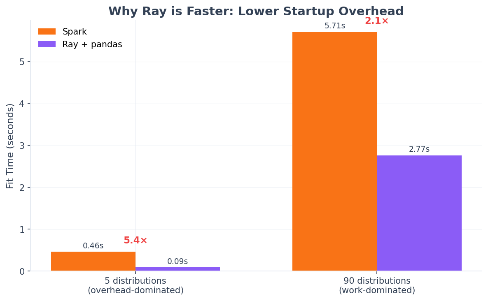

Performance & Scaling
=====================

This page documents the performance characteristics of spark-bestfit,
including scaling behavior, memory footprint, and tuning recommendations.

.. note::

   Benchmarks were run on a local development machine.
   Absolute times will vary based on your hardware and cluster configuration.
   The key insight is the **scaling characteristics**: sub-linear for data size,
   O(D) for distribution count. Run ``make benchmark`` to generate results for
   your environment.

Architecture Overview
---------------------

spark-bestfit uses a **histogram-based approach** that provides significant
performance advantages over naive distribution fitting:

1. **Compute histogram once**: A single distributed aggregation computes the data histogram
2. **Broadcast small data**: Only the histogram (~8KB) and a data sample are broadcast
3. **Parallel fitting**: Distributions are fitted in parallel across workers
4. **No data collection**: Raw data never leaves the workers

This design means **fit time scales sub-linearly with data size** -
the histogram computation is O(N) but very fast, while distribution fitting is O(1).

.. image:: _static/backend_data_size.png
   :alt: Backend comparison: data size scaling
   :width: 100%

Time Complexity
---------------

.. list-table::
   :header-rows: 1
   :widths: 30 30 40

   * - Operation
     - Complexity
     - Notes
   * - Data count/sample
     - O(N)
     - Single aggregation (shared across columns)
   * - Histogram computation
     - O(N * C)
     - One histogram per column
   * - Distribution fitting
     - O(C * D * B)
     - D distributions * B bins * C columns
   * - Total fit time
     - O(N) + O(C * D * B)
     - Data overhead shared, fitting scales with columns

Where:

- **N** = number of data rows
- **C** = number of columns being fitted
- **D** = number of distributions (~90 continuous by default)
- **B** = histogram bins (default: 100)

.. image:: _static/backend_dist_count.png
   :alt: Backend comparison: distribution count scaling
   :width: 100%

Memory Footprint
----------------

Driver Memory
^^^^^^^^^^^^^

The driver collects minimal data:

.. list-table::
   :header-rows: 1
   :widths: 40 30 30

   * - Component
     - Size
     - Scaling
   * - Histogram
     - ~8 KB
     - O(bins) - constant
   * - Results DataFrame
     - ~50 KB
     - O(distributions)
   * - Best results
     - ~1 KB
     - O(n) for best(n=...)

**Total driver overhead: < 100 KB** regardless of data size.

Executor Memory
^^^^^^^^^^^^^^^

Each executor receives broadcast variables:

.. list-table::
   :header-rows: 1
   :widths: 40 30 30

   * - Component
     - Size
     - Scaling
   * - Histogram broadcast
     - ~8 KB
     - O(bins)
   * - Data sample broadcast
     - ~80 KB
     - O(max_samples) default 10K
   * - Fitting workspace
     - ~1 MB
     - Per-task temporary

**Total executor overhead: < 2 MB per task** - safe for most cluster configurations.

Scaling Characteristics
-----------------------

Data Size Scaling
^^^^^^^^^^^^^^^^^

Fit time is **sub-linear** with data size due to the histogram-based approach.
A 40x increase in data results in only ~1.0x increase in time (vs 40x if O(N)).

.. note::

   **Why times appear nearly flat:** The histogram-based architecture means actual
   fitting operates on a fixed-size working set (~100 bins, ~10K samples), not raw data.
   The dominant cost is fitting ~90 distributions, which takes 2-5 seconds regardless
   of input data size.

Distribution Count Scaling
^^^^^^^^^^^^^^^^^^^^^^^^^^

Fit time scales with the number of distributions, but not uniformly - some scipy
distributions are computationally expensive:

.. list-table::
   :header-rows: 1
   :widths: 25 25 50

   * - # Distributions
     - Fit Time
     - Notes
   * - 5
     - ~0.5s
     - Fast distributions only
   * - 50
     - ~1.5s
     - Mix of fast/medium
   * - 90 (default)
     - ~5-6s
     - Includes slow distributions

The first ~50 distributions are fast (~30ms each). The remaining distributions
include slower ones like ``burr``, ``t``, and ``johnsonsb`` (~100-160ms each).

Spark Configuration
-------------------

For optimal performance, configure your SparkSession:

.. code-block:: python

    from pyspark.sql import SparkSession

    spark = (
        SparkSession.builder
        .appName("DistributionFitting")
        # Enable Arrow for efficient serialization
        .config("spark.sql.execution.arrow.pyspark.enabled", "true")
        # Enable Adaptive Query Execution
        .config("spark.sql.adaptive.enabled", "true")
        .config("spark.sql.adaptive.coalescePartitions.enabled", "true")
        # Adjust shuffle partitions based on cluster size
        .config("spark.sql.shuffle.partitions", "200")
        .getOrCreate()
    )

**Key configurations:**

- ``spark.sql.execution.arrow.pyspark.enabled``: **Required** for Pandas UDF performance.
  Arrow serialization is 10-100x faster than pickle.

- ``spark.sql.adaptive.enabled``: Recommended for automatic query optimization.

- ``spark.sql.shuffle.partitions``: Set based on your cluster size (2-4x executor cores).

Memory Budget by Data Scale
^^^^^^^^^^^^^^^^^^^^^^^^^^^

.. list-table::
   :header-rows: 1
   :widths: 25 25 25 25

   * - Data Scale
     - Driver Memory
     - Executor Memory
     - Notes
   * - 10M rows
     - 2 GB
     - 4 GB
     - Default settings work well
   * - 100M rows
     - 4 GB
     - 8 GB
     - Recommended for production
   * - 1B+ rows
     - 8 GB
     - 16 GB
     - Enable sampling

Tuning Recommendations
----------------------

num_partitions
^^^^^^^^^^^^^^

Controls parallelism for distribution fitting. spark-bestfit uses
**distribution-aware auto-partitioning** that calculates the optimal partition count:

.. code-block:: python

    # Default (recommended): auto-partitioning
    fitter.fit(df, "value")

    # Explicit override
    fitter.fit(df, "value", num_partitions=16)

**Recommendation**: Let the library auto-calculate partitions (default).

max_samples
^^^^^^^^^^^

For confidence intervals, controls the data sample size:

.. code-block:: python

    # Default: 10,000 samples
    result.confidence_intervals(df, "value")

    # Larger sample for more precision
    result.confidence_intervals(df, "value", max_samples=50000)

**Trade-off**: Larger samples -> more precise CI, more memory, slower bootstrap.

Default Exclusions
^^^^^^^^^^^^^^^^^^

spark-bestfit excludes 20 slow or problematic distributions by default, including:

- ``tukeylambda``, ``nct``, ``dpareto_lognorm``: Extremely slow (0.5-7+ seconds)
- ``levy_stable``, ``studentized_range``, ``kstwo``: Complex optimization
- ``kappa4``, ``ncx2``, ``ncf``, ``geninvgauss``: Slow or can hang

To see the full list:

.. code-block:: python

    from spark_bestfit.distributions import DistributionRegistry
    print(DistributionRegistry.DEFAULT_EXCLUSIONS)

To include a specific excluded distribution:

.. code-block:: python

    exclusions = DistributionRegistry.DEFAULT_EXCLUSIONS - {"levy_stable"}
    fitter = DistributionFitter(spark, excluded_distributions=tuple(exclusions))

Benchmark Comparison
--------------------

Performance across backends (local development machine, 10 cores):

.. include:: _static/benchmark_comparison.rst

Running Benchmarks
------------------

To run benchmarks locally and generate updated charts:

.. code-block:: bash

    # Run Spark benchmarks
    make benchmark

    # Run Ray benchmarks (requires ray installed)
    make benchmark-ray

    # Generate scaling charts
    make benchmark-charts

Benchmark results are saved to ``.benchmarks/`` and charts to ``docs/_static/``.

Related Documentation
---------------------

- :doc:`/backends` - Detailed backend comparison and configuration
- :doc:`/features/lazy-metrics` - Lazy metric evaluation for faster workflows
- :doc:`/features/prefiltering` - Skip incompatible distributions
- :doc:`/migration` - Version history and performance improvements
