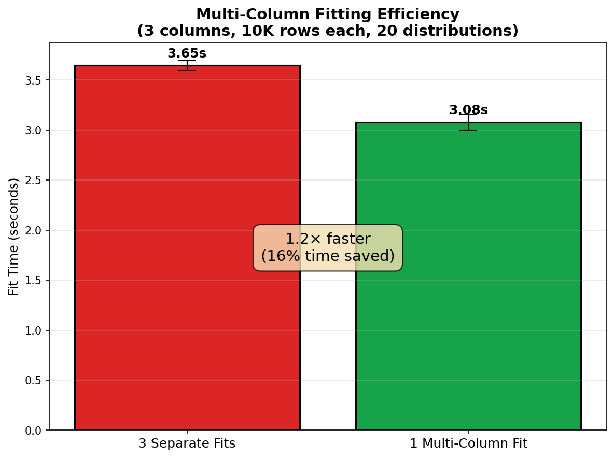

Performance & Scaling
=====================

This page documents the performance characteristics of spark-bestfit,
including scaling behavior, memory footprint, and tuning recommendations.

.. note::

   Benchmarks were run on a local development machine with local Spark.
   Absolute times will vary based on your hardware and cluster configuration.
   The key insight is the **scaling characteristics**: sub-linear for data size,
   O(D) for distribution count. Run ``make benchmark`` to generate results for
   your environment.

Architecture Overview
---------------------

spark-bestfit uses a **histogram-based approach** that provides significant
performance advantages over naive distribution fitting:

1. **Compute histogram once**: A single Spark aggregation computes the data histogram
2. **Broadcast small data**: Only the histogram (~8KB) and a data sample are broadcast to executors
3. **Parallel fitting**: Pandas UDFs fit distributions in parallel across partitions
4. **No data collection**: Raw data never leaves the executors

This design means **fit time scales sub-linearly with data size** —
the histogram computation is O(N) but very fast, while distribution fitting is O(1).

.. image:: _static/scaling_data_size.png
   :alt: Fit time vs data size
   :width: 100%

Time Complexity
---------------

.. list-table::
   :header-rows: 1
   :widths: 30 30 40

   * - Operation
     - Complexity
     - Notes
   * - Data count/sample
     - O(N)
     - Single Spark aggregation (shared across columns)
   * - Histogram computation
     - O(N × C)
     - One histogram per column
   * - Distribution fitting
     - O(C × D × B)
     - D distributions × B bins × C columns
   * - Total fit time
     - O(N) + O(C × D × B)
     - Data overhead shared, fitting scales with columns

Where:

- **N** = number of data rows
- **C** = number of columns being fitted
- **D** = number of distributions (~100 continuous, ~16 discrete)
- **B** = histogram bins (default: 100)

**Single-column:** O(N) + O(D × B) — histogram dominates for large N

**Multi-column (together):** O(N) + O(C × D × B) — data overhead paid once

**Multi-column (separate):** C × [O(N) + O(D × B)] — data overhead paid C times

This is why ``columns=[...]`` is faster than C separate ``column=`` calls:
the O(N) data operations are shared.

.. image:: _static/scaling_dist_count.png
   :alt: Fit time vs distribution count
   :width: 100%

Memory Footprint
----------------

Driver Memory
^^^^^^^^^^^^^

The driver collects minimal data:

.. list-table::
   :header-rows: 1
   :widths: 40 30 30

   * - Component
     - Size
     - Scaling
   * - Histogram
     - ~8 KB
     - O(bins) — constant
   * - Results DataFrame
     - ~50 KB
     - O(distributions)
   * - Best results
     - ~1 KB
     - O(n) for best(n=...)

**Total driver overhead: < 100 KB** regardless of data size.

Executor Memory
^^^^^^^^^^^^^^^

Each executor receives broadcast variables:

.. list-table::
   :header-rows: 1
   :widths: 40 30 30

   * - Component
     - Size
     - Scaling
   * - Histogram broadcast
     - ~8 KB
     - O(bins)
   * - Data sample broadcast
     - ~80 KB
     - O(max_samples) default 10K
   * - Fitting workspace
     - ~1 MB
     - Per-task temporary

**Total executor overhead: < 2 MB per task** — safe for most cluster configurations.

Scaling Characteristics
-----------------------

Data Size Scaling
^^^^^^^^^^^^^^^^^

Fit time is **sub-linear** with data size due to the histogram-based approach:

.. code-block:: text

    Data Size    | Fit Time  | Scaling Factor
    -------------|-----------|------------------
    25,000       | ~14.7s    | 1.0× (baseline)
    100,000      | ~19.6s    | ~1.3×
    500,000      | ~18.8s    | ~1.3×
    1,000,000    | ~23.4s    | ~1.6×

A 40× increase in data results in only ~1.6× increase in time (vs 40× if O(N)).

Distribution Count Scaling
^^^^^^^^^^^^^^^^^^^^^^^^^^

Fit time scales with the number of distributions, but not uniformly—some scipy
distributions are computationally expensive:

.. code-block:: text

    # Distributions | Fit Time  | Time per Distribution
    ----------------|-----------|----------------------
    5               | ~0.5s     | ~102ms (fast dists)
    20              | ~2.1s     | ~104ms (fast dists)
    50              | ~2.8s     | ~56ms (fast dists)
    100             | ~24.4s    | ~244ms (includes slow dists)

The first ~50 distributions are fast (~50-100ms each). The remaining distributions
include slow ones like ``levy_stable`` and ``studentized_range`` (~430ms each).

Multi-Column Efficiency
^^^^^^^^^^^^^^^^^^^^^^^

Fitting multiple columns in a single call is more efficient than fitting each
column separately. The efficiency gains come from shared Spark overhead:

- Single ``df.count()`` call for all columns
- Shared data sampling across columns
- Single broadcast setup per fit operation

**Recommendation**: When fitting the same distributions to multiple columns,
always use ``columns=[...]`` instead of separate ``column=`` calls.

.. code-block:: python

    # Efficient: single call for all columns
    results = fitter.fit(df, columns=["col1", "col2", "col3"])

    # Less efficient: 3 separate calls
    results1 = fitter.fit(df, column="col1")
    results2 = fitter.fit(df, column="col2")
    results3 = fitter.fit(df, column="col3")

.. note::
   Multi-column fitting scales well with data size. In benchmarks, fitting 3 columns
   with 100K rows each took similar time to 10K rows (~4.5s vs ~4.9s), demonstrating
   the sub-linear scaling benefits of the histogram-based approach.

Spark Configuration
-------------------

For optimal performance, configure your SparkSession with these recommended settings:

.. code-block:: python

    from pyspark.sql import SparkSession

    spark = (
        SparkSession.builder
        .appName("DistributionFitting")
        # Enable Arrow for efficient Pandas UDF serialization
        .config("spark.sql.execution.arrow.pyspark.enabled", "true")
        # Enable Adaptive Query Execution for dynamic optimization
        .config("spark.sql.adaptive.enabled", "true")
        .config("spark.sql.adaptive.coalescePartitions.enabled", "true")
        # Adjust shuffle partitions based on cluster size
        .config("spark.sql.shuffle.partitions", "200")
        .getOrCreate()
    )

**Key configurations:**

- ``spark.sql.execution.arrow.pyspark.enabled``: **Required** for Pandas UDF performance.
  Arrow serialization is 10-100x faster than pickle for DataFrame ↔ Pandas conversion.

- ``spark.sql.adaptive.enabled``: Recommended for automatic query optimization.
  AQE dynamically adjusts shuffle partitions and join strategies.

- ``spark.sql.shuffle.partitions``: Set based on your cluster size.
  Default is 200; adjust to 2-4× your total executor cores.

Memory Budget by Data Scale
^^^^^^^^^^^^^^^^^^^^^^^^^^^

Recommended memory settings for different data scales:

.. list-table::
   :header-rows: 1
   :widths: 25 25 25 25

   * - Data Scale
     - Driver Memory
     - Executor Memory
     - Notes
   * - 10M rows
     - 2 GB
     - 4 GB
     - Default settings work well
   * - 100M rows
     - 4 GB
     - 8 GB
     - Recommended for production
   * - 1B+ rows
     - 8 GB
     - 16 GB
     - Enable sampling with ``enable_sampling=True``

.. note::

   spark-bestfit uses broadcast variables for histogram and sample data,
   resulting in **< 100 KB driver overhead** regardless of data size.
   The memory recommendations above account for Spark framework overhead,
   not spark-bestfit itself.

Tuning Recommendations
----------------------

num_partitions
^^^^^^^^^^^^^^

Controls parallelism for distribution fitting:

.. code-block:: python

    # Default: uses spark.sql.shuffle.partitions
    fitter.fit(df, "value")

    # Explicit: more partitions = more parallelism
    fitter.fit(df, "value", num_partitions=16)

**Recommendation**: Set to 2-4× the number of executor cores.

max_samples
^^^^^^^^^^^

For confidence intervals, controls the data sample size:

.. code-block:: python

    # Default: 10,000 samples
    result.confidence_intervals(df, "value")

    # Larger sample for more precision
    result.confidence_intervals(df, "value", max_samples=50000)

**Trade-off**: Larger samples → more precise CI, more memory, slower bootstrap.

Excluding Slow Distributions
^^^^^^^^^^^^^^^^^^^^^^^^^^^^

Some distributions are computationally expensive. Exclude them for faster fitting:

.. code-block:: python

    from spark_bestfit import DistributionFitter, DEFAULT_EXCLUDED_DISTRIBUTIONS

    # Add slow distributions to the default exclusion list
    slow_dists = ("levy_stable", "studentized_range", "kstwo")
    exclusions = DEFAULT_EXCLUDED_DISTRIBUTIONS + slow_dists

    fitter = DistributionFitter(spark, excluded_distributions=exclusions)
    results = fitter.fit(df, "value")

**Common slow distributions**:

- ``levy_stable``: Complex optimization
- ``studentized_range``: Expensive CDF computation
- ``kstwo``: Numerical integration required

Running Benchmarks
------------------

To run benchmarks locally and generate updated charts:

.. code-block:: bash

    # Run all benchmarks
    make benchmark

    # Generate scaling charts
    make benchmark-charts

Benchmark results are saved to ``.benchmarks/`` and charts to ``docs/_static/``.

.. note::

   Benchmarks are excluded from normal CI runs. They are intended for
   local performance analysis and documentation updates.
