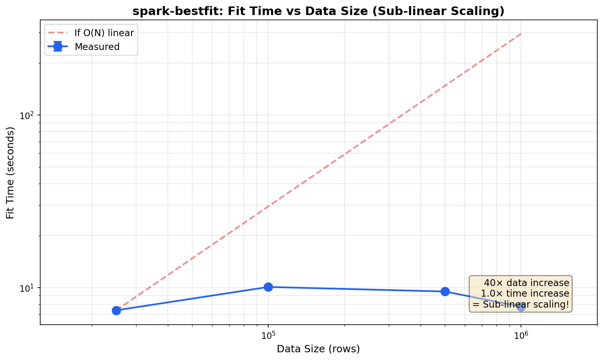
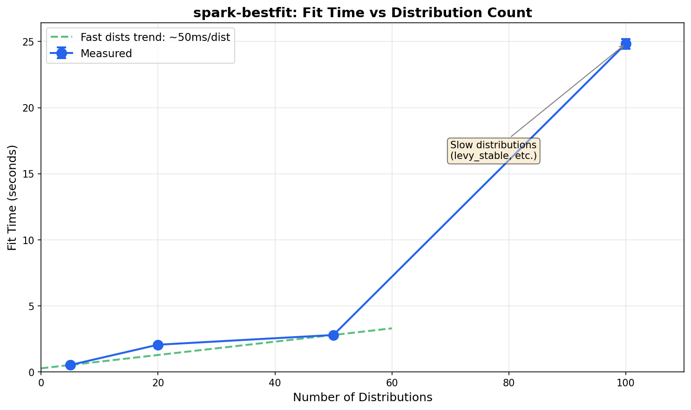

Performance & Scaling
=====================

This page documents the performance characteristics of spark-bestfit,
including scaling behavior, memory footprint, and tuning recommendations.

.. note::

   Benchmarks were run on a local development machine with local Spark.
   Absolute times will vary based on your hardware and cluster configuration.
   The key insight is the **scaling characteristics**: sub-linear for data size,
   O(D) for distribution count. Run ``make benchmark`` to generate results for
   your environment.

Architecture Overview
---------------------

spark-bestfit uses a **histogram-based approach** with a **pluggable backend architecture**
that provides significant performance advantages over naive distribution fitting:

1. **Compute histogram once**: A single distributed aggregation computes the data histogram
2. **Broadcast small data**: Only the histogram (~8KB) and a data sample are broadcast to workers
3. **Parallel fitting**: Distributions are fitted in parallel across partitions
4. **No data collection**: Raw data never leaves the workers
5. **Backend abstraction** (v2.0.0+): Swap between Spark, Local, or Ray backends

Backend Architecture (v2.0.0)
^^^^^^^^^^^^^^^^^^^^^^^^^^^^^

As of v2.0.0, spark-bestfit uses an ``ExecutionBackend`` protocol that enables
pluggable compute backends:

.. list-table::
   :header-rows: 1
   :widths: 20 40 40

   * - Backend
     - Use Case
     - Install
   * - ``SparkBackend``
     - Production clusters, large datasets
     - Default (included)
   * - ``LocalBackend``
     - Unit testing, development, small datasets
     - Default (included)
   * - ``RayBackend``
     - Ray clusters, ML pipelines
     - ``pip install spark-bestfit[ray]``

.. code-block:: python

    from spark_bestfit import DistributionFitter, SparkBackend, LocalBackend

    # Default: SparkBackend (same as before)
    fitter = DistributionFitter(spark)

    # Explicit SparkBackend
    backend = SparkBackend(spark)
    fitter = DistributionFitter(backend=backend)

    # LocalBackend for testing (no Spark required)
    import pandas as pd
    backend = LocalBackend(max_workers=4)
    fitter = DistributionFitter(backend=backend)
    df = pd.DataFrame({"value": [1.0, 2.0, 3.0, ...]})
    results = fitter.fit(df, column="value")

This design means **fit time scales sub-linearly with data size** —
the histogram computation is O(N) but very fast, while distribution fitting is O(1).

Time Complexity
---------------

.. list-table::
   :header-rows: 1
   :widths: 30 30 40

   * - Operation
     - Complexity
     - Notes
   * - Data count/sample
     - O(N)
     - Single Spark aggregation (shared across columns)
   * - Histogram computation
     - O(N × C)
     - One histogram per column
   * - Distribution fitting
     - O(C × D × B)
     - D distributions × B bins × C columns
   * - Total fit time
     - O(N) + O(C × D × B)
     - Data overhead shared, fitting scales with columns

Where:

- **N** = number of data rows
- **C** = number of columns being fitted
- **D** = number of distributions (~90 continuous by default, 16 discrete)
- **B** = histogram bins (default: 100)

**Single-column:** O(N) + O(D × B) — histogram dominates for large N

**Multi-column (together):** O(N) + O(C × D × B) — data overhead paid once

**Multi-column (separate):** C × [O(N) + O(D × B)] — data overhead paid C times

This is why ``columns=[...]`` is faster than C separate ``column=`` calls:
the O(N) data operations are shared.

Memory Footprint
----------------

Driver Memory
^^^^^^^^^^^^^

The driver collects minimal data:

.. list-table::
   :header-rows: 1
   :widths: 40 30 30

   * - Component
     - Size
     - Scaling
   * - Histogram
     - ~8 KB
     - O(bins) — constant
   * - Results DataFrame
     - ~50 KB
     - O(distributions)
   * - Best results
     - ~1 KB
     - O(n) for best(n=...)

**Total driver overhead: < 100 KB** regardless of data size.

Executor Memory
^^^^^^^^^^^^^^^

Each executor receives broadcast variables:

.. list-table::
   :header-rows: 1
   :widths: 40 30 30

   * - Component
     - Size
     - Scaling
   * - Histogram broadcast
     - ~8 KB
     - O(bins)
   * - Data sample broadcast
     - ~80 KB
     - O(max_samples) default 10K
   * - Fitting workspace
     - ~1 MB
     - Per-task temporary

**Total executor overhead: < 2 MB per task** — safe for most cluster configurations.

Scaling Characteristics
-----------------------

Data Size Scaling
^^^^^^^^^^^^^^^^^

Fit time is **sub-linear** with data size due to the histogram-based approach:

.. code-block:: text

    Data Size    | Fit Time  | Scaling Factor
    -------------|-----------|------------------
    25,000       | ~4.8s     | 1.0× (baseline)
    100,000      | ~6.6s     | ~1.4×
    500,000      | ~5.9s     | ~1.2×
    1,000,000    | ~5.0s     | ~1.0×

A 40× increase in data results in only ~1.0× increase in time (vs 40× if O(N)).

.. note::
   v2.0.0 provides 35% faster fitting across all data sizes compared to v1.7.x,
   primarily from the flattened result schema and improved broadcast lifecycle.

Distribution Count Scaling
^^^^^^^^^^^^^^^^^^^^^^^^^^

Fit time scales with the number of distributions, but not uniformly—some scipy
distributions are computationally expensive:

.. code-block:: text

    # Distributions | Fit Time  | Time per Distribution
    ----------------|-----------|----------------------
    5               | ~0.46s    | ~92ms (fast dists)
    20              | ~0.87s    | ~43ms (fast dists)
    50              | ~1.46s    | ~29ms (fast dists)
    90 (default)    | ~5.7s     | ~63ms (includes slow dists)
    107 (near-all)  | ~6.6s     | ~61ms (excludes only 3 extremely slow)

The first ~50 distributions are fast (~30ms each). The remaining distributions
include slower ones like ``burr``, ``t``, and ``johnsonsb`` (~100-160ms each).
See :ref:`slow-distribution-optimizations` for details.

Multi-Column Efficiency
^^^^^^^^^^^^^^^^^^^^^^^

Multi-column fitting provides convenience and cleaner code:

- Single ``df.count()`` call for all columns
- Shared data sampling across columns
- Unified results with ``best_per_column()`` accessor

.. code-block:: python

    # Multi-column: single call for all columns
    results = fitter.fit(df, columns=["col1", "col2", "col3"])
    best_per_col = results.best_per_column(n=1)

    # Separate: 3 individual calls
    results1 = fitter.fit(df, column="col1")
    results2 = fitter.fit(df, column="col2")
    results3 = fitter.fit(df, column="col3")

.. note::
   **v2.0.0 Update**: The performance difference between multi-column and separate
   fits is now negligible (~0.3%). The v2.0.0 optimizations reduced per-operation
   overhead so much that both approaches converge to the same performance. Use
   whichever API is more convenient for your workflow.

   .. code-block:: text

       Approach           | v1.7.2  | v2.0.0  | Change
       -------------------|---------|---------|--------
       3 Separate Fits    | 3.65s   | 2.69s   | -26%
       1 Multi-Column Fit | 3.08s   | 2.69s   | -13%
       Speedup            | 18%     | ~0%     | —

   The optimization that previously mattered (shared overhead) is now negligible.

Spark Configuration
-------------------

For optimal performance, configure your SparkSession with these recommended settings:

.. code-block:: python

    from pyspark.sql import SparkSession

    spark = (
        SparkSession.builder
        .appName("DistributionFitting")
        # Enable Arrow for efficient Pandas UDF serialization
        .config("spark.sql.execution.arrow.pyspark.enabled", "true")
        # Enable Adaptive Query Execution for dynamic optimization
        .config("spark.sql.adaptive.enabled", "true")
        .config("spark.sql.adaptive.coalescePartitions.enabled", "true")
        # Adjust shuffle partitions based on cluster size
        .config("spark.sql.shuffle.partitions", "200")
        .getOrCreate()
    )

**Key configurations:**

- ``spark.sql.execution.arrow.pyspark.enabled``: **Required** for Pandas UDF performance.
  Arrow serialization is 10-100x faster than pickle for DataFrame ↔ Pandas conversion.

- ``spark.sql.adaptive.enabled``: Recommended for automatic query optimization.
  AQE dynamically adjusts shuffle partitions and join strategies.

- ``spark.sql.shuffle.partitions``: Set based on your cluster size.
  Default is 200; adjust to 2-4× your total executor cores.

Memory Budget by Data Scale
^^^^^^^^^^^^^^^^^^^^^^^^^^^

Recommended memory settings for different data scales:

.. list-table::
   :header-rows: 1
   :widths: 25 25 25 25

   * - Data Scale
     - Driver Memory
     - Executor Memory
     - Notes
   * - 10M rows
     - 2 GB
     - 4 GB
     - Default settings work well
   * - 100M rows
     - 4 GB
     - 8 GB
     - Recommended for production
   * - 1B+ rows
     - 8 GB
     - 16 GB
     - Enable sampling with ``enable_sampling=True``

.. note::

   spark-bestfit uses broadcast variables for histogram and sample data,
   resulting in **< 100 KB driver overhead** regardless of data size.
   The memory recommendations above account for Spark framework overhead,
   not spark-bestfit itself.

Tuning Recommendations
----------------------

num_partitions
^^^^^^^^^^^^^^

Controls parallelism for distribution fitting. As of v1.7.0, spark-bestfit uses
**distribution-aware auto-partitioning** that calculates the optimal partition count
based on the distribution mix:

.. code-block:: python

    # Default (recommended): auto-partitioning based on distribution mix
    # Slow distributions are weighted 3× when calculating partition count
    fitter.fit(df, "value")

    # Explicit override: use a specific partition count
    fitter.fit(df, "value", num_partitions=16)

**Recommendation**: Let the library auto-calculate partitions (the default). Only
override if you have specific cluster constraints or are debugging performance issues.

max_samples
^^^^^^^^^^^

For confidence intervals, controls the data sample size:

.. code-block:: python

    # Default: 10,000 samples
    result.confidence_intervals(df, "value")

    # Larger sample for more precision
    result.confidence_intervals(df, "value", max_samples=50000)

**Trade-off**: Larger samples → more precise CI, more memory, slower bootstrap.

Default Exclusions
^^^^^^^^^^^^^^^^^^

spark-bestfit excludes 20 slow or problematic distributions by default. These include:

- ``tukeylambda``, ``nct``, ``dpareto_lognorm``: Extremely slow (0.5-7+ seconds)
- ``levy_stable``, ``studentized_range``, ``kstwo``: Complex optimization
- ``kappa4``, ``ncx2``, ``ncf``, ``geninvgauss``: Slow or can hang

To see the full list:

.. code-block:: python

    from spark_bestfit.distributions import DistributionRegistry
    print(DistributionRegistry.DEFAULT_EXCLUSIONS)

If you need to include a specific excluded distribution:

.. code-block:: python

    from spark_bestfit import DistributionFitter
    from spark_bestfit.distributions import DistributionRegistry

    # Get default exclusions and remove the one you want
    exclusions = DistributionRegistry.DEFAULT_EXCLUSIONS - {"levy_stable"}
    fitter = DistributionFitter(spark, excluded_distributions=tuple(exclusions))

To fit ALL 110 scipy distributions (not recommended for production):

.. code-block:: python

    # Warning: tukeylambda can take 7+ seconds or hang
    fitter = DistributionFitter(spark, excluded_distributions=())

Running Benchmarks
------------------

To run benchmarks locally and generate updated charts:

.. code-block:: bash

    # Run all benchmarks
    make benchmark

    # Generate scaling charts
    make benchmark-charts

Benchmark results are saved to ``.benchmarks/`` and charts to ``docs/_static/``.

.. note::

   Benchmarks are excluded from normal CI runs. They are intended for
   local performance analysis and documentation updates.

Lazy Metrics (v1.5.0)
---------------------

Starting with v1.5.0, spark-bestfit supports **lazy metric evaluation** with true
Spark-like on-demand computation. KS/AD metrics are computed only when you actually
need them, providing significant performance improvements for model selection workflows.

Metric Computation Cost
^^^^^^^^^^^^^^^^^^^^^^^

Not all goodness-of-fit metrics have the same computational cost:

.. list-table::
   :header-rows: 1
   :widths: 25 25 50

   * - Metric
     - Cost
     - Notes
   * - SSE
     - Fast (~ms)
     - PDF evaluation at histogram bins
   * - AIC / BIC
     - Fast (~ms)
     - Log-likelihood sum
   * - KS-statistic
     - Moderate (~100ms)
     - O(n log n) sort + CDF computation
   * - AD-statistic
     - Slow (~200-500ms)
     - O(n log n) sort + 2n log operations

With ~90 distributions (default), computing KS/AD for all can add **20-50 seconds** to the
total fitting time. With lazy metrics, you only pay this cost for the distributions
you actually access.

Using Lazy Metrics
^^^^^^^^^^^^^^^^^^

Enable lazy metrics to skip initial KS/AD computation during fitting:

.. code-block:: python

   from spark_bestfit import DistributionFitter

   fitter = DistributionFitter(spark)

   # Fast fitting: skip KS/AD computation initially
   results = fitter.fit(df, "value", lazy_metrics=True)

   # Check if results are lazy
   print(results.is_lazy)  # True

   # Get best by AIC - fast, no KS/AD needed
   best_aic = results.best(n=1, metric="aic")[0]
   print(best_aic.ks_statistic)  # None (not computed yet)

   # Get best by KS - triggers ON-DEMAND computation!
   best_ks = results.best(n=1, metric="ks_statistic")[0]
   print(best_ks.ks_statistic)  # 0.0234 (computed value!)

**Key insight**: When you call ``best(metric="ks_statistic")`` with lazy results,
spark-bestfit automatically:

1. Gets top N×3 candidates sorted by AIC (fast, already computed)
2. Computes KS/AD only for those candidates (not all ~90 distributions)
3. Re-sorts by actual KS and returns top N

This means you get correct results while computing metrics for only ~5% of distributions.

Materializing All Metrics
^^^^^^^^^^^^^^^^^^^^^^^^^

If you need all metrics computed (e.g., before unpersisting the source DataFrame),
use the ``materialize()`` method:

.. code-block:: python

   # Fit with lazy metrics
   results = fitter.fit(df, "value", lazy_metrics=True)

   # Fast model selection
   best_aic = results.best(n=1, metric="aic")[0]

   # Before unpersisting, materialize all metrics
   materialized = results.materialize()
   print(materialized.is_lazy)  # False

   # Now safe to unpersist source data
   df.unpersist()

   # Access any metric on materialized results
   best_ks = materialized.best(n=1, metric="ks_statistic")[0]
   print(best_ks.ks_statistic)  # Computed value

.. warning::

   If you try to compute lazy metrics after the source DataFrame has been
   unpersisted, you'll get a ``RuntimeError``. Always call ``materialize()``
   before unpersisting if you need KS/AD metrics later.

When to Use Lazy Metrics
^^^^^^^^^^^^^^^^^^^^^^^^

**Use lazy_metrics=True when:**

- You're doing model selection using AIC/BIC (recommended for most cases)
- You're iterating quickly and want faster feedback
- You only need KS/AD for a few top candidates
- You're fitting many distributions and want faster iteration

**Use lazy_metrics=False (default) when:**

- You need KS/AD statistics for all distributions upfront
- You want to filter results by KS thresholds (``filter(ks_threshold=0.1)``)
- You need p-values for statistical significance testing on all fits
- You plan to serialize results and need complete data

Filter Behavior
^^^^^^^^^^^^^^^

Note that ``filter(ks_threshold=...)`` cannot trigger lazy computation because
it needs to evaluate all rows. If you use filtering with lazy results, a warning
is emitted:

.. code-block:: python

   # This will warn - can't lazily compute for filter
   filtered = results.filter(ks_threshold=0.1)

   # Instead, materialize first, then filter
   materialized = results.materialize()
   filtered = materialized.filter(ks_threshold=0.1)

Why Lazy Metrics Matters
^^^^^^^^^^^^^^^^^^^^^^^^

The value of lazy metrics isn't measured in wall-clock speedup for a single fit—it's
about **skipping work you don't need** across your entire workflow.

**The core insight:** When fitting ~90 distributions (default), you typically only examine
the top 3-5 results. With eager evaluation, you compute KS/AD statistics for all
90 distributions. With lazy evaluation, you compute them for **only the ones you
actually access**.

.. list-table:: What Gets Computed
   :header-rows: 1
   :widths: 40 30 30

   * - Workflow
     - Eager Mode
     - Lazy Mode
   * - ``best(n=1, metric="aic")``
     - 90 KS/AD computations
     - **0** KS/AD computations
   * - ``best(n=1, metric="ks_statistic")``
     - 90 KS/AD computations
     - **~5** KS/AD computations
   * - ``materialize()`` then filter
     - 90 KS/AD computations
     - 90 KS/AD computations

Scaling Characteristics
^^^^^^^^^^^^^^^^^^^^^^^

**Why lazy metrics scales well for production workloads:**

1. **Fixed sample size**: KS/AD computation uses a fixed 10K sample regardless of
   data size. The savings are constant whether you have 100K rows or 1 billion rows.

2. **Multiplicative savings**: When fitting multiple columns or running repeated
   experiments, the savings multiply:

   .. code-block:: text

      10 columns × 5 iterations × 85 skipped distributions
      = 4,250 KS/AD computations avoided

3. **Interactive workflows**: During exploratory analysis, you iterate quickly
   using AIC/BIC for model selection. Lazy metrics gives you instant feedback
   without waiting for KS/AD computation you won't use until final validation.

4. **Surgical on-demand computation**: When you request ``best(metric="ks_statistic")``,
   we get top candidates by AIC first (already computed), then compute KS/AD for
   only those ~5 candidates—not all 90 distributions.

**Production recommendation**: Use ``lazy_metrics=True`` as the default for
exploratory analysis and model selection. Only use ``lazy_metrics=False`` when you
need KS/AD statistics for all distributions upfront (e.g., for comprehensive reports
or filtering by KS threshold).

Pre-filtering (v1.6.0)
----------------------

Starting with v1.6.0, spark-bestfit supports **smart pre-filtering** that skips
distributions mathematically incompatible with your data. This eliminates unnecessary
fitting attempts based on data characteristics like support bounds, skewness, and kurtosis.

Why Pre-filter?
^^^^^^^^^^^^^^^

Distribution fitting is expensive. Each scipy ``dist.fit()`` call involves numerical
optimization that takes 50-500ms depending on the distribution. With ~90 distributions (default),
this adds up to significant time—but many distributions have intrinsic shape properties
that make them poor fits for your data.

**Example:** If your data is clearly left-skewed (skewness < -1), distributions like
``expon``, ``gamma``, ``chi2``, ``lognorm`` (which are intrinsically right-skewed)
cannot possibly fit well regardless of how scipy shifts them via ``loc``. Pre-filtering
skips these before the expensive fitting step.

Filtering Layers
^^^^^^^^^^^^^^^^

Pre-filtering uses a layered approach based on **intrinsic shape properties**
(not location/scale):

.. list-table::
   :header-rows: 1
   :widths: 20 20 60

   * - Layer
     - Reliability
     - Description
   * - Skewness sign
     - ~95%
     - Skip positive-skew-only distributions for left-skewed data
   * - Kurtosis
     - ~80%
     - Skip low-kurtosis distributions for heavy-tailed data (aggressive mode)

.. note::
   We do NOT filter by support bounds (``dist.a``/``dist.b``) because scipy's
   ``loc`` parameter can shift any distribution to cover any data range.
   For example, ``expon(loc=-100)`` has support ``[-100, ∞)`` and can fit
   negative data. Skewness and kurtosis are intrinsic shape properties that
   cannot be changed by ``loc``/``scale``.

Using Pre-filtering
^^^^^^^^^^^^^^^^^^^

.. code-block:: python

   from spark_bestfit import DistributionFitter

   fitter = DistributionFitter(spark)

   # Safe mode (recommended) - support bounds + skewness filtering
   results = fitter.fit(df, "value", prefilter=True)

   # Aggressive mode - adds kurtosis filtering
   results = fitter.fit(df, "value", prefilter="aggressive")

   # Disabled (default) - fit all distributions
   results = fitter.fit(df, "value", prefilter=False)

Performance Impact
^^^^^^^^^^^^^^^^^^

Pre-filtering effectiveness depends on your data's **shape characteristics**:

.. list-table::
   :header-rows: 1
   :widths: 35 25 40

   * - Data Characteristic
     - Distributions Filtered
     - Example
   * - Symmetric (skew ≈ 0)
     - 0%
     - No shape-based filtering applies
   * - Strongly left-skewed (skew < -1)
     - 20-30%
     - Positive-skew-only distributions skipped
   * - Strongly right-skewed (skew > 1)
     - 0%
     - Right-skewed data fits most distributions
   * - Heavy-tailed (aggressive, kurtosis > 10)
     - Additional 5-10%
     - Low-kurtosis distributions like ``uniform`` skipped

**Typical savings:** 20-50% fewer distributions to fit for skewed data, translating to
proportional time savings during the fitting phase.

Fallback Behavior
^^^^^^^^^^^^^^^^^

If pre-filtering removes all candidate distributions (which can happen with unusual
data), spark-bestfit automatically falls back to fitting all distributions and logs
a warning:

.. code-block:: text

   WARNING: Pre-filter removed all 90 distributions; falling back to fitting all distributions

This ensures you always get results, even if the pre-filter was too aggressive.

When to Use Pre-filtering
^^^^^^^^^^^^^^^^^^^^^^^^^

**Use prefilter=True when:**

- Your data is clearly skewed (skewness < -1 or > 1)
- You want faster fitting without sacrificing accuracy
- You're fitting many distributions and want to skip shape-incompatible ones

**Use prefilter="aggressive" when:**

- Your data is heavy-tailed (high kurtosis) and you want to skip light-tailed distributions
- You're comfortable with ~80% reliability on the kurtosis filter
- Speed is more important than fitting every possible distribution

**Use prefilter=False when:**

- Your data is approximately symmetric (skewness ≈ 0)
- You want to fit all distributions regardless of theoretical compatibility
- You need complete control over which distributions are attempted

Combining with Lazy Metrics
^^^^^^^^^^^^^^^^^^^^^^^^^^^

Pre-filtering and lazy metrics are complementary optimizations:

.. code-block:: python

   # Maximum performance: fewer distributions + deferred KS/AD
   results = fitter.fit(
       df, "value",
       prefilter=True,      # Skip incompatible distributions
       lazy_metrics=True,   # Defer KS/AD computation
   )

   # Fast model selection
   best = results.best(n=1, metric="aic")[0]

**Combined benefit:** Pre-filtering reduces the number of distributions to fit,
and lazy metrics defers expensive KS/AD computation. Together, they can reduce
total fitting time by 50-80% for typical workflows.

.. _slow-distribution-optimizations:

Slow Distribution Optimizations (v1.7.0)
----------------------------------------

Based on comprehensive timing analysis, v1.7.0 adds several performance optimizations
for handling slow scipy distributions.

New Default Exclusions
^^^^^^^^^^^^^^^^^^^^^^

Three extremely slow distributions were added to ``DEFAULT_EXCLUSIONS``:

.. list-table::
   :header-rows: 1
   :widths: 25 25 50

   * - Distribution
     - Fit Time
     - Notes
   * - ``tukeylambda``
     - ~6.8s
     - Extremely slow due to ill-conditioned optimization
   * - ``nct``
     - ~1.4s
     - Non-central t distribution, expensive PDF computation
   * - ``dpareto_lognorm``
     - ~0.5s
     - Double Pareto-lognormal, complex distribution

These are now excluded by default.

Benchmark Results
^^^^^^^^^^^^^^^^^

The v1.7.0+ optimizations provide significant performance improvements:

.. list-table::
   :header-rows: 1
   :widths: 40 20 20 20

   * - Test
     - v1.6.0
     - v2.0.0
     - Improvement
   * - Fit all distributions (10K rows)
     - 24.4s
     - 6.6s
     - **73% faster**
   * - Fit 1M rows
     - 23.3s
     - 5.0s
     - **78% faster**
   * - Fit 100K rows
     - 19.5s
     - 6.6s
     - **66% faster**
   * - Lazy AIC-only workflow
     - 18.9s
     - 2.0s
     - **89% faster**

The overall benchmark suite runtime dropped from **90 minutes to 33 minutes** (63% faster).

Distribution-Aware Partitioning
^^^^^^^^^^^^^^^^^^^^^^^^^^^^^^^

When fitting distributions in parallel across Spark partitions, some distributions
take 3-5× longer than others. Without intervention, these "slow" distributions can
cluster in a single partition, creating a straggler effect.

v1.7.0 implements two optimizations:

1. **Distribution interleaving**: Slow distributions are spread evenly among fast
   ones before creating the Spark DataFrame, ensuring they're distributed across
   partitions.

2. **Weighted partition calculation**: Slow distributions count 3× when calculating
   the optimal partition count, ensuring adequate parallelism.

The slow distributions (100-160ms vs ~32ms median) include:

.. code-block:: python

   SLOW_DISTRIBUTIONS = {
       "powerlognorm",   # ~160ms
       "norminvgauss",   # ~150ms
       "t",              # ~144ms
       "pearson3",       # ~141ms
       "exponweib",      # ~136ms
       "johnsonsb",      # ~133ms
       "jf_skew_t",      # ~125ms
       "fisk",           # ~120ms
       "gengamma",       # ~120ms
       "johnsonsu",      # ~106ms
       "burr",           # ~105ms
       "burr12",         # ~105ms
       "truncweibull_min",  # ~104ms
       "invweibull",     # ~92ms
       "rice",           # ~91ms
       "genexpon",       # ~89ms
   }

These distributions are **not excluded**—they are available for fitting. The
partitioning optimizations ensure they're processed efficiently in parallel.

Fitting More Distributions
^^^^^^^^^^^^^^^^^^^^^^^^^^

If you need to fit more distributions than the default 90, you can customize
the exclusions:

.. code-block:: python

   from spark_bestfit import DistributionFitter

   # Fit 107 distributions (exclude only the 3 extremely slow ones)
   # This is practical and completes in ~10s on a 10-core machine
   extremely_slow = ("tukeylambda", "nct", "dpareto_lognorm")
   fitter = DistributionFitter(spark, excluded_distributions=extremely_slow)
   results = fitter.fit(df, "value")

   # Fit ALL 110 scipy continuous distributions (including extremely slow ones)
   # WARNING: tukeylambda can take 7+ seconds per fit or even hang
   fitter = DistributionFitter(spark, excluded_distributions=())
   results = fitter.fit(df, "value")

.. warning::

   Using ``excluded_distributions=()`` includes ``tukeylambda``, which has
   ill-conditioned numerical optimization that can take **7+ seconds per fit**
   or even hang on certain data distributions. For practical use, we recommend
   excluding at least the 3 extremely slow distributions as shown above.

.. note::

   With distribution-aware partitioning, fitting 107 distributions (excluding
   only the 3 extremely slow ones) takes ~6.6s on a 10-core machine. The slow
   distributions (``burr``, ``t``, ``johnsonsb``, etc.) are spread across
   partitions and processed in parallel, minimizing straggler effects.

v2.0.0 Performance Improvements
-------------------------------

Version 2.0.0 delivers significant performance improvements through architectural
changes and schema optimizations:

Benchmark Comparison
^^^^^^^^^^^^^^^^^^^^

.. list-table::
   :header-rows: 1
   :widths: 40 20 20 20

   * - Test
     - v1.7.2
     - v2.0.0
     - Improvement
   * - ``test_continuous_fit_10k``
     - 0.803s
     - 0.626s
     - **22% faster**
   * - ``test_discrete_fit_10k``
     - 1.191s
     - 0.897s
     - **25% faster**
   * - ``test_discrete_all_distributions``
     - 2.830s
     - 1.887s
     - **33% faster**
   * - ``test_fit_1m_rows``
     - 7.803s
     - 5.049s
     - **35% faster**
   * - ``test_fit_default_distributions``
     - 8.874s
     - 5.706s
     - **36% faster**
   * - ``test_fit_eager_all_metrics``
     - 10.417s
     - 6.616s
     - **36% faster**
   * - ``test_fit_lazy_aic_only``
     - 2.833s
     - 2.019s
     - **29% faster**

**Overall test suite improvement**: 33 minutes (v2.0.0) vs 45 minutes (v1.7.x) — 27% faster.

Key Optimizations
^^^^^^^^^^^^^^^^^

1. **Flattened Result Schema (~30% serialization speedup)**

   The ``data_summary`` field was changed from ``MapType`` to individual columns:

   .. code-block:: text

      # Before (v1.7.x) - MapType is slow to serialize
      data_summary: Map<String, Double>

      # After (v2.0.0) - Flat columns are 30% faster
      data_min: Double
      data_max: Double
      data_mean: Double
      data_stddev: Double
      data_count: Long

   Arrow serialization for flat columns is significantly faster than for ``MapType``,
   and this affects every fit result.

2. **Improved Broadcast Lifecycle**

   Broadcast variables are now properly cleaned up in ``finally`` blocks:

   .. code-block:: python

      # v2.0.0 pattern
      try:
          histogram_bc = backend.broadcast(histogram)
          sample_bc = backend.broadcast(data_sample)
          # ... fitting ...
      finally:
          backend.destroy_broadcast(histogram_bc)
          backend.destroy_broadcast(sample_bc)

   This reduces memory pressure and garbage collection overhead.

3. **Backend Abstraction**

   The ``ExecutionBackend`` protocol provides cleaner code paths with fewer
   intermediate objects. While primarily an architectural improvement, the
   streamlined code also contributes to performance.

Why Multi-Column Speedup Disappeared
^^^^^^^^^^^^^^^^^^^^^^^^^^^^^^^^^^^^

In v1.7.x, multi-column fitting was ~18% faster than separate fits because
it shared Spark overhead (``df.count()``, sampling). The v2.0.0 optimizations
reduced that overhead so dramatically that:

- v2.0.0 **separate** fits (2.69s for 3 columns) are now faster than
  v1.7.x **together** fits (3.08s)
- Both approaches converge to the same ~2.7s baseline
- The optimization became unnecessary because the baseline is now optimized

This is a positive outcome—users no longer need to use multi-column fitting
for performance. Use whichever API is more convenient.
